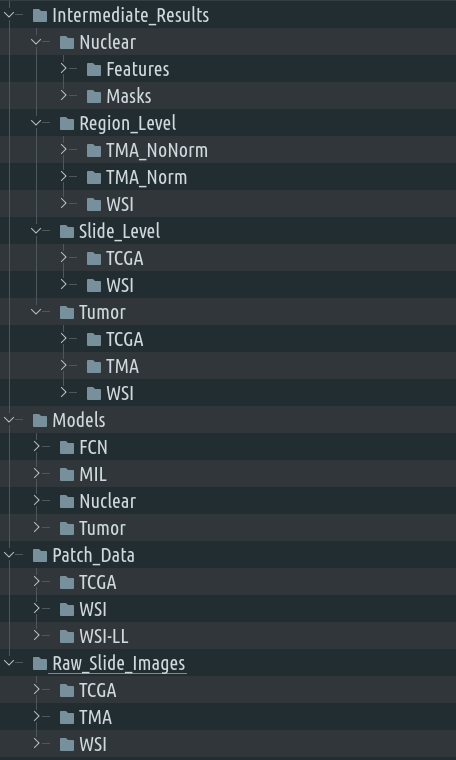

All H&E data and models used in the publication are available publicly on FigShare as follows (*(Please note that links to the data will be available upon publication*):

1. WSI Cohort H&E Data 
2. TMA Cohorts H&E Data
3. Models

The following table shows the amount of svs files that you should have downloaded for each cohort after following our instructions.

| Cohort | Number of SVS Files |
| --- | ----------- |
| WSI | 1292 |
| TCGA | 519 |
| TMA1 | 3 |
| TMA2 | 10 |
| PDX1 | 2 |

Note: For the WSI and TCGA cohorts, the numbers differ from what we use in the paper because we apply quality control to determine which files are usable for each cohort. For WSI each svs sample represents a single patient. Although we have provided the full dataset of 1292 samples for our WSI cohort, 10 of those samples did not generate sufficient patches to use during the training and evaluation of our deep learning models. To see which samples did not generate enough patches, please refer to the **Number_Patches_Extracted** column in the [All Samples File](Data_Files/WSI/allSamples_UpdatedCV_BL.csv). For TCGA, although we list a total of 519 slides from the TCGA KIRC dataset, cBioPortal only provided genetic information for 389 slides. Additionally, 5 of those patients had 2 or more slides present and we only used one slide per patient, resulting in 383 usable slides. Like WSI, samples that did not generate enough patches were not used in the study, resulting in 363 total samples used. To see which samples were used, please refer to the **PassedQC** column in the [TCGA Genetics file](Data_Files/TCGA/tcga_genetics_PanCancerNoCNA.csv). (True = was used, False = was not used).

# Data Saving Instructionspi

To enable the code to access your data you will need to create a directory with the structure indicated in the figure below in a location accessible by your code/cluster.  Note that the raw data alone will occupy ~500GB, while intermediate results generated will total several terabytes, so please ensure you have enough space. Additionally, there is a specific directory structure that you must create for our code to execute correctly. We have provided a convenience script to achieve this. Please run the following steps:

1. In Params/Path_Params.py change the DataDir variable to point to wherever you plan to store the data. **Note: you need to do this even if you plan to create directories manually to allow the code to find your data.**
2. Run the Directory Generation script: Create_Data_Directory.py 

The `Raw_Slide_Images` and the `Models` folder are the only folders you will need to populate with the data and models that we are releasing. The other two folders will populate when you execute the code that corresponds to them.

## Downloading WSI and TMA cohort images

All of the data corresponding to the WSI and TMA (TMA1, TMA2, PDX1) cohorts can be found on Figshare.  The entirety of the WSI cohort can be found here: WSI(*link avaiable upon publication*). This must be downloaded directly into the `Raw_Slide_Images/WSI/` folder. To download, select the **Download all** option in the bottom section of the FigShare page.  Please note that this is a very large cohort (1292 files, ~475GB) and will likely take quite a bit of time to download. The TMA cohorts data files can be found here: TMA(*link available upon publication*). Similarly, these files must be downloaded directly into the `Raw_Slide_Images/TMA/` folder. This will be a much smaller and quicker download (15 files, ~13GB).

## Downloading the TCGA whole slide images

This included all the "clinical", i.e., FFPE, slide images for the KIRC project available from the GDC portal. The manifest generated for this download can be found at ``Data_Files/TCGA/gdc_manifest.2021-02-23.txt``, and can be used to obtain all files using the `gdc-client`. By downloading these files to the `Raw_Slide_Images/TCGA/` folder, they will automatically be organized as expected by the code.

## Downloading Pre-trained Models 

All models (for gene prediction at slide/region level, tumor identification and nuclear segmentation) are available as a single zip file on Figshare here: Models(*link available upon publication*). Unlike the data, FigShare will not show a preview for this zip file. To download, select the **Download** option in the bottom section of the the FigShare page. The contents of this zip must be extracted into the `Models` folder. After extracting, the directory architecture should be same as the one shown above. 
