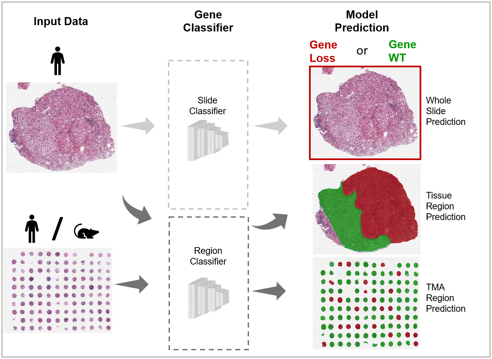

#  Intratumoral Resolution of Driver Gene Mutation Heterogeneity in Renal Cancer Using Deep Learning 
Code for the paper "Intratumoral Resolution of Driver Gene Mutation Heterogeneity in Renal Cancer Using Deep Learning" by Acosta *et al* currently under provisional acceptance in [Cancer Research](https://aacrjournals.org/cancerres](https://aacrjournals.org/cancerres/article/82/15/2792/707325/Intratumoral-Resolution-of-Driver-Gene-Mutation))




# Instructions:

To enable users to reproduce our results from scratch, we have publicly deposited:

1. The code (here)
2. A singularity container to execute the code (on Dockerhub)
3. All underlying H&E image data and associated gene type labels (on Figshare).
4. Our trained models (on Figshare) for:
   - BAP1/PBRM1/SETD2 prediction at both slide and regional level
   - Tumor region prediction
   - Nuclear segmentation

A jupyter notebook to generate the figures in the paper from saved results can be found [here](FigureMasterScript.ipynb). To regenerate these results from the raw data please follow the steps below in sequential order

| Step                          | Description                                                  | Documentation                                 |
| ----------------------------- | ------------------------------------------------------------ | --------------------------------------------- |
| 1. Setup Software Environment | Clone this repository, and download a singularity container with all packages used from DockerHub | [Environment](Environment_README.md)          |
| 2. Data Download              | Get deposited data for WSI, TMA1, TMA2 and PDX cohorts from [figshare](www.figshare.com) and for TCGA from the [GDC portal](https://portal.gdc.cancer.gov/), and save in the directory structure expected by our code. | [Data](Data_Instructions.md)                  |
| 3. Data Preparation         | Extract tumor area masks and generate patches for the different cohort based on these | [Preparation](Data_Preparation/README.md)   |
| 4. Model Training             | Train separate models for Slide and Region level predictions (alternately, to simply validate our results you can download our trained models from figshare) | [Training](Gene_Model_Training/README.md)     |
| 5. Model Evaluation           | Apply the Slide/Region level models to the different cohorts | [Evaluation](Gene_Model_Evaluation/README.md) |
| 6. Hand Crafted Features      | Perform nuclear segmentation and extract hand crafted nuclear features on the WSI cohort | [Handcrafted](Handcrafted/README.md)                      |
| 7. Generate Figures           | Analyze saved model results to generate figures in the paper. Please note that to generate the Confidence Intervals that we present, you must run this [script](Figure_Generation/Confidence_Intervals.py) | [Figures](FigureMasterScript.ipynb)           |


# Software Notes:

All code was developed and tested on a singularity image based on Ubuntu 18.04 running Python 3.6.9, tensorflow 2.0.0, and scikit-learn 0.21.3. All packages used in this code are included in the container, except for [statannot](https://github.com/webermarcolivier/statannot), [tiler](https://github.com/the-lay/tiler), and [StainTools](https://github.com/Peter554/StainTools)  which were used for adding statistical information to two figures, executing the regional inference, and performing normalization transformations, respectively. For convenience to the user, we have included the versions of all three packages used by our code as part of this repository, but note that it was cloned directly from the parent Github repository under [External](External).


## Citation
If you find our work helpful or use our code/data in your research, please consider citing our paper:
```
@article{article,
   author = {Acosta, Paul H and Panwar, Vandana and Jamarle, Vipul and Christie, Alana and Jasti, Jay and   Margulis, Vitaly and Rakheja, Dinesh and Cheville, John and Leibovish, Bradley C and Parker, Alexander and Brugarolas, James and Kapur, Payal and Rajaram, Satwik},
   year = {2022},
   month = {08},
   pages = {2792–2806},
   title = {Intratumoral Resolution of Driver Gene Mutation Heterogeneity in Renal Cancer Using Deep Learning},
   volume = {82},
   issue = {15},
   journal = {Cancer Research},
   doi = {10.1038/s41551-022-00952-9}
}
```

